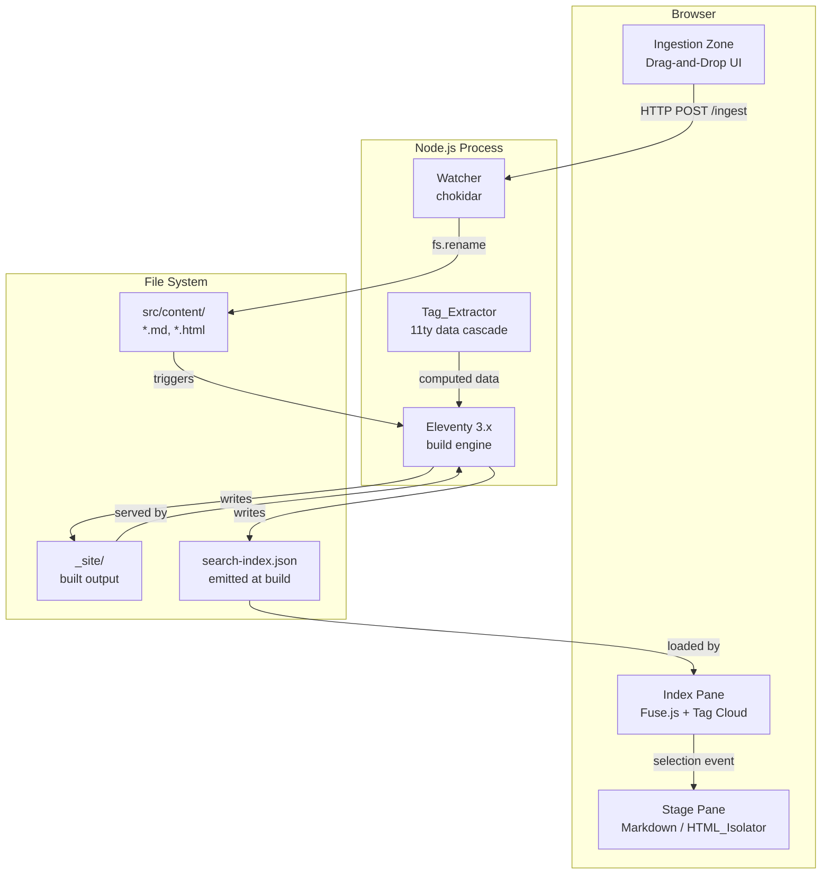

# Design Document: vault-sidecar

## Overview

vault-sidecar is a local-first static-site digital repository built on [Eleventy (11ty) 3.x](https://11ty.dev). It renders Markdown notes and standalone HTML reports with the visual weight of a premium print publication. The system is tag-driven — bypassing folder hierarchies — and provides fluid, multi-dimensional content discovery through a searchable Index pane and a rendering Stage pane.

The application runs entirely on the local machine. There is no server-side persistence, no authentication, and no network dependency beyond the local dev server. The build pipeline is:

1. A file is dropped onto the Ingestion Zone in the browser.
2. A Node.js Watcher process moves the file into the 11ty source folder.
3. 11ty rebuilds the site.
4. The browser hot-reloads via 11ty's built-in WebSocket-based dev server.

### Key Design Decisions

- **11ty as the build engine**: 11ty's tag-based Collections map directly onto the tag-driven architecture. Its built-in dev server provides WebSocket-based DOM-diffing hot reload with ~2ms startup time.
- **Fuse.js for client-side search**: Zero-dependency fuzzy search library that operates entirely in the browser against a pre-built JSON search index emitted at build time.
- **Shadow DOM for HTML isolation**: The HTML_Isolator uses a `<div>` with an attached open Shadow Root to encapsulate standalone HTML content, preventing CSS bleed in both directions. An `<iframe sandbox>` is used as a fallback for content that requires full JS isolation.
- **Shiki for syntax highlighting**: Build-time syntax highlighting via `@shikijs/markdown-it`, producing zero-runtime CSS-in-HTML token spans compatible with the editorial theme.
- **chokidar for the Watcher**: Cross-platform file-system watcher that debounces rapid file events and triggers 11ty rebuilds.

---

## Architecture



### Request / Response Flow

1. User drops a file onto the Ingestion Zone.
2. The browser sends a `POST /ingest` multipart request to the Watcher's HTTP endpoint (default port 3001).
3. The Watcher validates the file type, handles name conflicts, and moves the file to `src/content/`.
4. chokidar detects the change and spawns an 11ty rebuild.
5. 11ty runs the Tag_Extractor for any file lacking front matter, then builds the full site.
6. 11ty's dev server pushes a WebSocket reload event to all connected browsers.
7. The browser receives the event and performs a DOM-diff update without a full page refresh.

---

## Components and Interfaces

### 1. Ingestion Zone

A browser-side component rendered as part of the 11ty layout. It exposes a drop target and communicates with the Watcher via `fetch`.

**Interface:**

```typescript
// Client-side module: src/assets/js/ingestion-zone.ts
interface IngestResponse {
  status: 'ok' | 'conflict' | 'error';
  filename?: string;
  message?: string;
}

async function ingestFiles(files: FileList): Promise<IngestResponse[]>
```

**Watcher HTTP endpoint:**

```
POST /ingest
Content-Type: multipart/form-data

Fields:
  file        — the file binary
  overwrite   — 'true' | 'false'  (optional, for conflict resolution)
```

Accepted MIME types: `text/markdown`, `text/html`, `application/octet-stream` with `.md` or `.html` extension.

### 2. Watcher

A standalone Node.js process (`watcher.js`) started via `npm run dev`. It combines:
- An HTTP server (Node built-in `http`) listening on port 3001 for `/ingest` requests.
- A chokidar watcher on `src/content/` that triggers `eleventy --serve` rebuilds.

```typescript
// watcher.js public interface (CLI)
// Start:  node watcher.js
// Stop:   Ctrl-C (SIGINT)

interface WatcherConfig {
  contentDir: string;       // default: 'src/content'
  port: number;             // default: 3001
  debounceMs: number;       // default: 300
}
```

The Watcher does **not** spawn a separate 11ty process — it runs alongside `eleventy --serve` which is started as part of the same `npm run dev` script via `concurrently`.

### 3. Tag_Extractor

An 11ty computed data function (`src/_data/tagExtractor.js`) that runs during the build for every Content_Item. It is invoked via 11ty's [computed data](https://www.11ty.dev/docs/data-computed/) feature.

```typescript
// Computed data function signature
interface TagExtractorInput {
  content: string;          // raw file content
  page: {
    inputPath: string;
    date: Date;
  };
  tags?: string[];          // existing front matter tags, if any
}

interface TagExtractorOutput {
  tags: string[];           // normalized, lowercase, hyphen-separated
}

function extractTags(data: TagExtractorInput): TagExtractorOutput
```

Tag normalization rules:
- Lowercase only
- Replace spaces and underscores with hyphens
- Strip all characters except `[a-z0-9-]`
- Deduplicate

Fallback chain (applied in order when no front matter tags exist):
1. Extract top-3 most frequent meaningful words from content (stop-word filtered).
2. Use `YYYY-MM` of the file's last-modified date.
3. Assign `untagged` if the file cannot be read.

### 4. HTML_Isolator

A client-side Web Component (`<html-isolator>`) that renders standalone HTML content inside a Shadow Root, preventing CSS bleed in both directions.

```typescript
// Custom element: src/assets/js/html-isolator.ts
class HtmlIsolator extends HTMLElement {
  // Attribute: src — URL of the HTML file to load
  // Attribute: fallback-iframe — 'true' to force iframe mode

  connectedCallback(): void
  private renderShadow(html: string): void
  private renderIframe(src: string): void
}

customElements.define('html-isolator', HtmlIsolator);
```

Rendering strategy:
1. Fetch the HTML file content via `fetch(src)`.
2. Parse with `DOMParser`.
3. Attach an open Shadow Root to the host element.
4. Inject the parsed `<body>` children and all `<style>` / `<link rel="stylesheet">` elements into the Shadow Root.
5. Execute `<script>` tags by re-creating them inside the Shadow Root scope.
6. If any external resource fetch fails, log the URL and continue rendering remaining content.

For content that requires full document-level JS isolation (e.g., `document.write`, `window` globals), fall back to `<iframe sandbox="allow-scripts allow-same-origin">`.

### 5. Index Pane

A client-side module that manages the left navigation panel.

```typescript
// src/assets/js/index-pane.ts
interface ContentItem {
  id: string;
  title: string;
  tags: string[];
  date: string;       // ISO 8601
  url: string;
  type: 'markdown' | 'html';
}

interface IndexState {
  items: ContentItem[];
  query: string;
  selectedTags: Set<string>;
  sortMode: 'recent' | 'alpha';
  activeItemId: string | null;
}

function filterItems(state: IndexState): ContentItem[]
function renderIndex(state: IndexState): void
function initSearch(items: ContentItem[]): Fuse<ContentItem>
```

The search index is a JSON file (`/search-index.json`) emitted by 11ty at build time. Fuse.js is initialized with `keys: ['title', 'tags']` and `threshold: 0.3`.

### 6. Stage Pane

A client-side module that loads and displays the selected Content_Item.

```typescript
// src/assets/js/stage-pane.ts
function loadItem(item: ContentItem): Promise<void>
function applyFadeTransition(el: HTMLElement, durationMs: number): void
```

For Markdown items: navigate to the pre-rendered 11ty page URL inside the Stage's `<article>` element via `fetch` + `innerHTML` swap with a 200ms fade.

For HTML items: instantiate `<html-isolator src="...">` inside the Stage.

---

## Data Models

### Content Item (11ty template data)

Each Content_Item in `src/content/` exposes the following data shape after 11ty's data cascade:

```typescript
interface ContentItemData {
  title: string;            // from front matter or derived from filename
  date: Date;               // from front matter or file mtime
  tags: string[];           // from front matter or Tag_Extractor
  type: 'markdown' | 'html';
  url: string;              // 11ty-generated permalink
  inputPath: string;        // relative path to source file
  content: string;          // rendered HTML (for Markdown) or raw (for HTML)
}
```

### Search Index

Emitted to `_site/search-index.json` by an 11ty global data file:

```typescript
interface SearchIndex {
  generated: string;        // ISO 8601 timestamp
  items: SearchIndexItem[];
}

interface SearchIndexItem {
  id: string;               // url used as stable ID
  title: string;
  tags: string[];
  date: string;             // ISO 8601
  url: string;
  type: 'markdown' | 'html';
}
```

### Tag Normalization

Tags are stored and compared as normalized strings conforming to:

```
tag ::= [a-z][a-z0-9-]*
```

The Tag_Extractor's normalization function is a pure transformation:

```typescript
function normalizeTag(raw: string): string
function normalizeTags(raw: string[]): string[]
```

### Watcher Ingest Request / Response

```typescript
interface IngestRequest {
  file: Buffer;
  filename: string;
  mimeType: string;
  overwrite: boolean;
}

interface IngestResponse {
  status: 'ok' | 'conflict' | 'error';
  filename?: string;   // final filename after rename (if conflict resolved)
  message?: string;    // human-readable error or conflict description
}
```

---

## Correctness Properties

*A property is a characteristic or behavior that should hold true across all valid executions of a system — essentially, a formal statement about what the system should do. Properties serve as the bridge between human-readable specifications and machine-verifiable correctness guarantees.*

### Property 1: Unsupported file type is always rejected

*For any* filename whose extension is neither `.md` nor `.html`, the Ingestion Zone's validation function SHALL return an error result that identifies the unsupported file type.

**Validates: Requirements 1.3**

### Property 2: Batch ingestion processes all valid files

*For any* non-empty list of valid `.md` or `.html` files submitted in a single drop operation, every file in the list SHALL be moved to the 11ty source folder and produce an `ok` response.

**Validates: Requirements 1.5**

### Property 3: Tag_Extractor always produces at least one tag

*For any* Content_Item input — including items with no front matter, empty content, or unreadable files — the Tag_Extractor SHALL return a non-empty tag array.

**Validates: Requirements 2.3, 2.4, 3.1, 3.2**

### Property 4: Tag format invariant

*For any* Content_Item processed by the Tag_Extractor, every tag in the output SHALL match the pattern `[a-z][a-z0-9-]*` (lowercase, hyphen-separated, no special characters other than hyphens).

**Validates: Requirements 3.3**

### Property 5: Tag normalization is idempotent (round-trip)

*For any* array of raw tag strings, applying `normalizeTags` twice SHALL produce the same result as applying it once — i.e., `normalizeTags(normalizeTags(tags))` equals `normalizeTags(tags)`.

**Validates: Requirements 3.4**

### Property 6: Markdown rendering preserves CommonMark structure

*For any* valid CommonMark document string, the rendered HTML SHALL contain structural elements corresponding to every syntactic construct present in the input (headings → `<h1>`–`<h6>`, lists → `<ul>`/`<ol>`, blockquotes → `<blockquote>`, fenced code blocks → `<pre><code>`, inline code → `<code>`).

**Validates: Requirements 4.2, 4.3**

### Property 7: Title derivation is always non-empty and well-formed

*For any* Markdown file — whether the title comes from front matter or is derived from the filename — the display title SHALL be a non-empty string. When derived from a filename, it SHALL contain no hyphens or underscores and SHALL be title-cased.

**Validates: Requirements 4.4, 4.5**

### Property 8: HTML_Isolator provides bidirectional CSS encapsulation

*For any* CSS rule defined inside the HTML_Isolator's shadow root, that rule SHALL NOT affect elements outside the shadow boundary; and *for any* CSS rule defined in the outer document, that rule SHALL NOT affect elements inside the shadow root.

**Validates: Requirements 5.2, 5.3**

### Property 9: Index displays all content items

*For any* list of ContentItems with no active search query or tag filter, the rendered Index SHALL contain an entry for every item in the list.

**Validates: Requirements 6.1**

### Property 10: Sort order correctness

*For any* list of ContentItems, the "Recent" sort SHALL produce a date-descending ordering and the "Alphabetical" sort SHALL produce a title-ascending ordering.

**Validates: Requirements 6.2**

### Property 11: Text search filter correctness

*For any* non-empty search query string and any list of ContentItems, every item returned by `filterItems` SHALL have a title or at least one tag that matches the query (case-insensitive substring or fuzzy match within the configured threshold).

**Validates: Requirements 6.3**

### Property 12: Tag filter intersection correctness

*For any* non-empty set of selected tags and any list of ContentItems, every item returned by `filterItems` SHALL be associated with ALL selected tags (single-tag selection is the degenerate case of this property).

**Validates: Requirements 6.4, 6.5**

---

## Error Handling

| Scenario | Component | Behavior |
|---|---|---|
| Dropped file is not `.md` or `.html` | Ingestion Zone | Display error message with unsupported type; do not move file |
| File name conflict on ingest | Watcher | Return `status: 'conflict'`; browser prompts user to overwrite or rename |
| Tag_Extractor cannot read a file | Tag_Extractor | Log error; assign tag `untagged` |
| External resource in HTML item fails to load | HTML_Isolator | Log failed URL; render remaining content |
| 11ty rebuild fails | Watcher | Log build error to console; preserve last successful `_site/` output in browser |
| Fuse.js search index not yet available | Index Pane | Disable search input with loading indicator until index is fetched |
| `<html-isolator>` fetch fails | Stage Pane | Display inline error message in Stage; do not crash surrounding layout |

---

## Testing Strategy

### Unit Tests (Vitest)

Focus on pure functions and specific scenarios with concrete examples:

- `normalizeTag` / `normalizeTags` — specific known transformations (e.g., `"Hello World"` → `"hello-world"`)
- `extractTags` — specific fallback scenarios: unreadable file → `['untagged']`, empty content → date tag
- `filterItems` — specific query/tag combinations with known fixture data
- `deriveTitle` — specific filename examples (e.g., `"my-project_notes.md"` → `"My Project Notes"`)
- Watcher ingest validation — specific MIME type cases, conflict detection with known filenames
- HTML_Isolator — JS isolation: script sets `window.testVar`, assert outer `window.testVar` is undefined
- Stage transitions — assert computed `transition-duration` ≤ 200ms; tag filter transition ≤ 150ms
- Responsive layout — assert Index collapses at viewport < 1024px

### Property-Based Tests (fast-check)

Use [fast-check](https://fast-check.dev/) with a minimum of 100 iterations per property.

Each test is tagged with a comment in the format:
`// Feature: vault-sidecar, Property N: <property_text>`

- **Property 1** — Unsupported file type rejection: generate arbitrary filenames with non-.md/.html extensions, assert all are rejected with an error identifying the type.
- **Property 2** — Batch ingestion: generate arbitrary non-empty lists of valid files, assert all produce `ok` responses.
- **Property 3** — Non-empty tag output: generate arbitrary ContentItem inputs (including empty content, null content), assert output tags length ≥ 1.
- **Property 4** — Tag format invariant: generate arbitrary content strings, run `extractTags`, assert all output tags match `/^[a-z][a-z0-9-]*$/`.
- **Property 5** — Tag normalization idempotence: generate arbitrary string arrays, assert `normalizeTags(normalizeTags(x))` equals `normalizeTags(x)`.
- **Property 6** — CommonMark rendering: generate valid CommonMark documents with known syntax elements, assert rendered HTML contains corresponding structural elements.
- **Property 7** — Title derivation: generate arbitrary filenames and front matter title strings, assert derived title is non-empty, title-cased, and free of hyphens/underscores.
- **Property 8** — CSS isolation: generate arbitrary CSS rules, inject inside shadow root, assert no effect on outer elements; inject in outer document, assert no effect on shadow root elements.
- **Property 9** — Index completeness: generate arbitrary ContentItem lists with no filter, assert rendered index entry count equals input list length.
- **Property 10** — Sort correctness: generate arbitrary ContentItem lists, assert recent sort is date-descending and alpha sort is title-ascending.
- **Property 11** — Text filter correctness: generate arbitrary item lists and query strings, assert all returned items match the query predicate.
- **Property 12** — Tag intersection filter: generate arbitrary item lists and tag sets, assert all returned items contain every selected tag.

### Integration Tests

- Watcher HTTP endpoint: POST a valid `.md` file, assert it appears in `src/content/`.
- Watcher conflict handling: POST a file with an existing name, assert `status: 'conflict'` response.
- Watcher rebuild trigger: move a file into `src/content/`, assert 11ty rebuild is triggered within 2 seconds.
- 11ty build pipeline: trigger a build with a fixture content directory, assert `_site/` and `search-index.json` are produced.
- 11ty collections: build with fixture content tagged `foo`, assert `collections.foo` contains the item.
- HTML_Isolator: mount the custom element with a fixture HTML file, assert Shadow Root is attached and outer styles are not affected.
- Browser hot reload: complete a rebuild, assert browser receives WebSocket reload event without full page refresh.

### Smoke Tests

- `npm run dev` starts without errors and the dev server responds on the configured port.
- `search-index.json` is present and valid JSON after a clean build.
- Watcher starts and stops cleanly via `npm run dev` / Ctrl-C (SIGINT).
